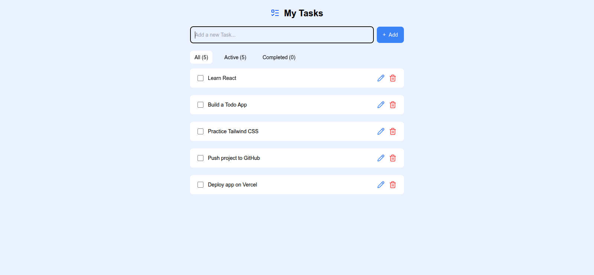
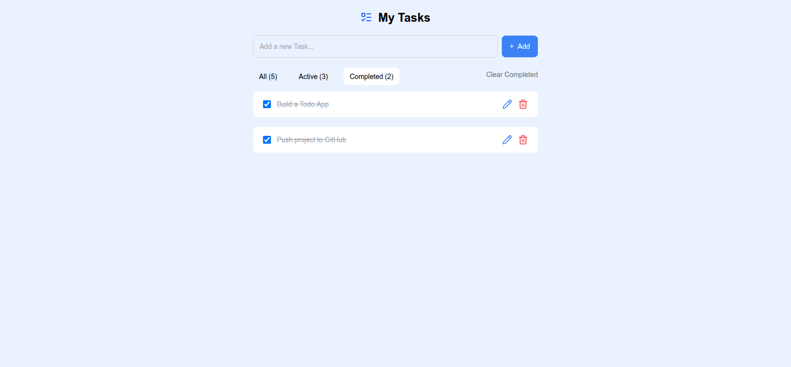

# 📝 Todo App (React)

A modern and simple Todo Application built with React that helps users manage their daily tasks efficiently. The app supports adding, editing, deleting, completing, and filtering tasks. All tasks are saved in localStorage, so data is not lost after refreshing the page.

## 🚀 Features

- Add new tasks
- Edit existing tasks
- Delete tasks
- Mark tasks as completed
- Filter tasks (All / Active / Completed)
- Clear completed tasks
- Persistent storage using localStorage
- Toast notifications for user actions
- Fully responsive design

## 🛠️ Tech Stack

- React
- Tailwind CSS
- Lucide React Icons
- React Hot Toast
- Local Storage

## ⚙️ Installation & Setup

```bash
git clone https://github.com/Tayyab365/todo-app
cd todo-app
npm install
npm run dev
The app will run on:
http://localhost:5173

## 📸 Screenshots

### Home / Empty State


### Tasks Added


### Completed Tasks


🌐 Live Demo
Live URL: https://tayyab-todo-app.vercel.app/

📂 Project Structure

src/
components/
AddTodo.jsx
TodoItem.jsx
TodoList.jsx
TodoStatus.jsx
todo/
Todo.jsx
App.jsx
main.jsx

📌 How It Works
Each task contains an id, text, and status (completed or not). Tasks are managed using React state and stored in localStorage. Users can filter tasks based on their completion status and update them in real time.

📄 License
This project is open-source and free to use.

👨‍💻 Author
Muhammad Tayyab
GitHub: https://github.com/Tayyab365
```
